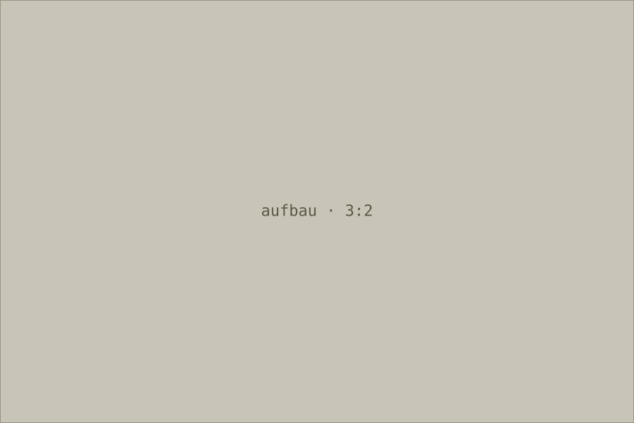

Erster Absatz: Ausgangslage und Auftrag. Markdown wird serverseitig
gerendert, eingebettetes HTML ist deaktiviert oder wird sanitisiert.

Zweiter Absatz: der eigentliche Weg zur Lösung, mit den Entscheidungen,
die begründungspflichtig waren.

## Aufbau



*abb. 1 — Aufbau des Prototyps: Flask-Anwendung, PostgreSQL, nginx davor.*

Dritter Absatz: was sich im Betrieb bewährt hat und was nicht.

```
beitrag = self.beitraege.get(slug)
if beitrag is None:
    abort(404)
```

Abschließender Absatz: Ergebnis, Übergabe, offene Punkte.
